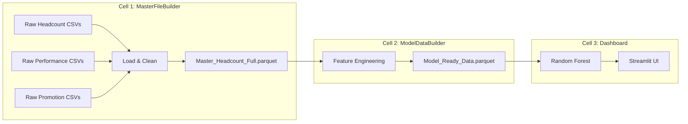
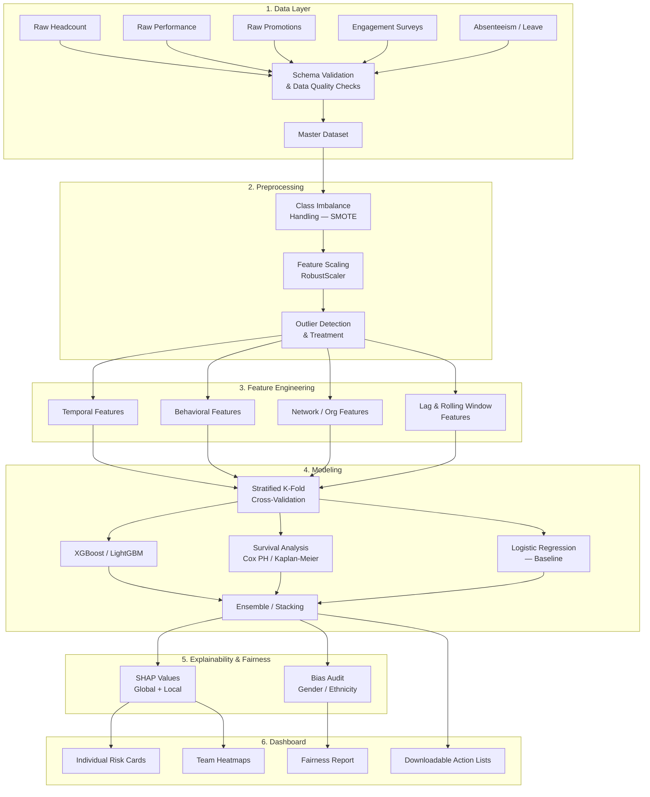
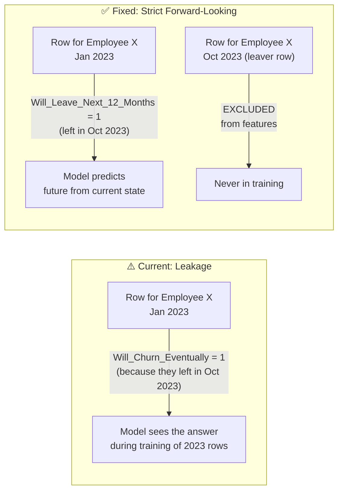
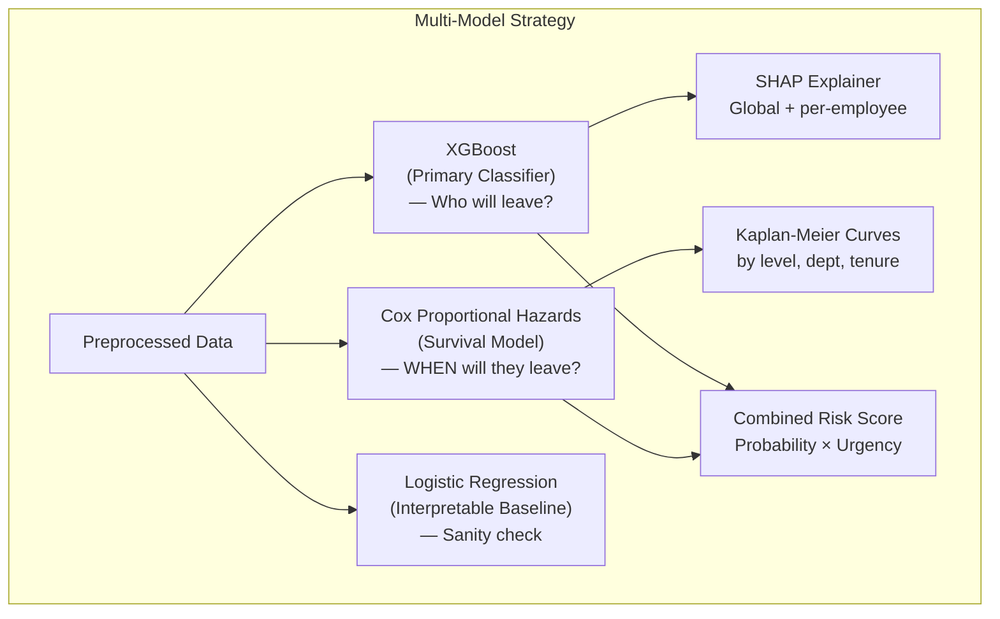
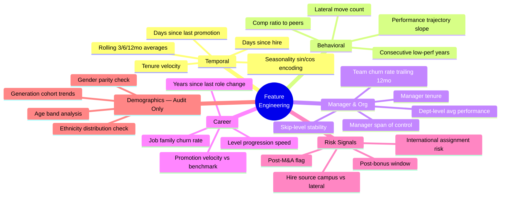

# 🔍 Comprehensive Review: Attrition Prediction Pipeline

## Executive Summary

Your [Masterdashboard.ipynb](file:///c:/Users/mishr/Downloads/Masterdashboard.ipynb) establishes a solid foundation — it consolidates HR data, engineers meaningful features, and delivers a Streamlit dashboard with a Random Forest model. However, when benchmarked against **2024-2025 industry standards**, there are significant gaps in data engineering, model sophistication, explainability, and fairness. This review identifies **every gap** and provides a concrete upgrade path.

---

## 1. Architecture: Current vs. Industry Standard

### Current Architecture

### Industry-Standard Architecture (Target State)

---

## 2. Gap Analysis — Detailed Findings

### 🔴 Critical Issues

| # | Area | Current State | Industry Standard | Impact |
|---|------|--------------|-------------------|--------|
| 1 | **Class Imbalance** | Not handled at all | SMOTE / ADASYN / class weights tuned via CV | Model biased toward majority class; inflated accuracy, poor recall |
| 2 | **Validation Strategy** | Simple year-based train/test split | Stratified K-Fold CV (k=5) + temporal holdout | Overfitting risk; unreliable AUC/Recall metrics |
| 3 | **Model Choice** | Random Forest only | XGBoost / LightGBM primary; RF + LR as baselines; ensemble | Missing 5-15% AUC improvement; less robust predictions |
| 4 | **Explainability** | Feature importance bar chart only | SHAP (summary, dependence, force plots) per-employee | HR can't understand *why* a specific employee is flagged |
| 5 | **Data Leakage** | `Will_Churn_Eventually` uses same-year future info; leaver rows not fully excluded from features | Target must be strictly forward-looking; train set must never see test-year events | **Artificially inflated metrics; model won't generalize** |
| 6 | **Feature Scaling** | None | RobustScaler or StandardScaler before model training | RF is tree-based (immune), but any future LR/SVM/NN will fail |

### 🟡 Major Gaps

| # | Area | Current State | Industry Standard | Impact |
|---|------|--------------|-------------------|--------|
| 7 | **Unused Columns** | ~80% of headcount headers are ignored | Demographic, diversity, job family, termination reason, FTE, etc. are strong predictors | Massive feature loss |
| 8 | **Survival Analysis** | Not present | Cox PH model for time-to-event; Kaplan-Meier curves by cohort | No "when will they leave?" — only "will they leave?" |
| 9 | **Temporal Features** | Limited (Year, Month, bonus window) | Seasonality, rolling averages (3/6/12mo), velocity of change, trend indicators | Misses behavioral momentum |
| 10 | **Hyperparameter Tuning** | Hardcoded (`n_estimators=100, max_depth=10`) | Optuna / GridSearchCV / RandomizedSearchCV | Sub-optimal model performance |
| 11 | **Fairness / Bias** | Not considered | Audit predictions by Gender, Ethnicity, Age; equalized odds | Legal and ethical risk (especially with DEI data available) |
| 12 | **Data Quality** | No validation; silent failures | Schema checks, distribution drift detection, missing-value reports | Bad data → bad predictions, silently |

### 🟢 Minor Improvements

| # | Area | Current State | Industry Standard |
|---|------|--------------|-------------------|
| 13 | **Code Structure** | Single monolithic notebook | Modular Python package (`src/data`, `src/features`, `src/models`) |
| 14 | **Pipeline Reproducibility** | No versioning, no config file | Config YAML + MLflow/Weights & Biases experiment tracking |
| 15 | **Dashboard UX** | Functional but basic | Risk drill-down per employee, trend-over-time charts, manager view |

---

## 3. Deep Dive: What Your Data Can Do (But Isn't Doing)

Based on the headcount headers you shared, here are **high-value features you're currently ignoring**:

### A. Demographic & Diversity (Ethical Use Required)
- `Gender`, `US Ethnicity`, `Age`, `Generation` → Cohort-level attrition patterns (NOT for individual prediction due to bias risk, but essential for **fairness auditing**)
- `Veteran Status`, `Disability Status` → Protected class monitoring

### B. Job & Career Trajectory
- `Job Family`, `Job Family Group`, `Job Profile` → Captures role-specific churn (e.g., technologists vs. investment professionals churn differently)
- `Time In Title (Current)` → A more granular version of your `Cycles_In_Level`
- `On Cycle Promotion - To Management Level` → Direct promotion signal (more accurate than your nomination-based proxy)
- `Analyst Class Year`, `Intern Class Year` → Cohort analysis for early-career retention

### C. Organizational & Manager Signals
- `Active Manager Direct EMP Reports`, `Active Manager All EMP+CWK Reports` → Manager span of control (large spans → less attention → higher churn)
- `Supervisory Organization` → Team-level churn clustering
- `Level 1-10 Org` → Multi-level org hierarchy for roll-up analytics

### D. Employment Context
- `Worker Type`, `Employee Type`, `FTE`, `Time Type` → Part-time / contingent workers have different churn dynamics
- `International Assignment Flag`, `iHub Locations Flag` → Mobility-based risk factors
- `Termination Reason Category`, `Termination Reason` → **Gold** for training — voluntary vs. involuntary termination
- `Acquisition Company` → Post-M&A churn is a well-documented phenomenon

### E. Pre-Computed Flags (Already in Your Data!)
- `HC_Future_Term_Current Year_EE_Vol` / `_Invol` → Voluntary vs. involuntary future termination flags
- `HC_Hire_Campus_Comm`, `HC_Hire_Lateral_Comm` → Hire source (campus hires churn differently than lateral hires)

---

## 4. Data Leakage — The Critical Bug

**Your current target**: `Will_Churn_Eventually` is computed as `groupby('Employee_ID', 'Year')['Is_Leaver_Row'].transform('max')`. This means a January row already "knows" that the employee will leave in December of the same year. The model memorizes this instead of learning predictive signals.

**Fix**: The target should be: *"Did this employee leave within the next N months after this snapshot?"* — constructed by looking forward from each snapshot date, not by looking at same-year aggregates.

---

## 5. Model Comparison: What You Should Be Using

### Current: Random Forest
- ✅ Handles non-linear relationships
- ✅ Robust to outliers
- ❌ No native handling of class imbalance beyond `class_weight`
- ❌ Feature importances are biased toward high-cardinality features
- ❌ Not the best performer for tabular data in 2025

### Recommended: XGBoost + SHAP (Primary) + Survival Analysis (Secondary)

**Why XGBoost?**
- Consistently outperforms RF on tabular HR data by 5-15% AUC
- Built-in handling of missing values
- Native support for `scale_pos_weight` for class imbalance
- Faster training with better regularization

**Why Survival Analysis?**
- Answers "**when** will they leave?" not just "will they?"
- Handles censored data (employees who haven't left *yet*)
- Produces Kaplan-Meier curves that HR leaders intuitively understand

---

## 6. Proposed Feature Engineering Upgrades

---

## 7. Dashboard Upgrades

### Current Dashboard
- 4 KPI metrics (AUC, Recall, Precision, Population)
- Feature importance bar chart
- Risk distribution histogram
- Confusion matrix
- High-risk list + Saveable stars table

### Industry-Standard Dashboard Should Include

| Feature | Description | Priority |
|---------|-------------|----------|
| **Individual Risk Cards** | Click an employee → see their SHAP waterfall diagram explaining *why* they're flagged | 🔴 Critical |
| **Manager Scorecard** | Per-manager view: team churn history, current risk distribution, span of control | 🔴 Critical |
| **Trend Over Time** | Historical attrition rate + model risk score by month/quarter | 🟡 High |
| **Survival Curves** | Kaplan-Meier retention curves by level, department, tenure cohort | 🟡 High |
| **Fairness Tab** | Risk score distribution by gender, ethnicity, age — audit for algorithmic bias | 🟡 High |
| **What-If Simulator** | "If we promote this person, how does their risk change?" (SHAP-based counterfactuals) | 🟢 Nice-to-have |
| **Department Heatmap** | Color-coded org chart by average risk score | 🟢 Nice-to-have |

---

## 8. Questions About Your Data

> [!IMPORTANT]
> I need answers to these questions to design the best possible upgrade:

1. **Voluntary vs. Involuntary Turnover**: The headers include `Termination Reason Category` and `Termination Reason`. Are these populated? The model should **only predict voluntary attrition** — predicting layoffs is meaningless for retention.

2. **Target Definition**: What prediction horizon does HR care about? "Will they leave in the **next 6 months**? 12 months? This calendar year?" This changes the target variable design.

3. **Data Volume**: How many years of data do you have, and roughly how many employees per year? (This determines if survival analysis is feasible and how we should cross-validate.)

4. **Engagement / Survey Data**: Do you have *any* employee satisfaction, engagement survey, or pulse survey data? These are the single strongest predictors of voluntary attrition in the literature. If not available now, is there a plan to collect them?

5. **Compensation Data**: Is there any salary / bonus / compensation data linked to employees? Compensation gap is a top-3 attrition driver.

6. **Absenteeism Data**: Do you have leave/absence records? Absenteeism spikes are a leading indicator of departure.

7. **The `HC_Future_Term_*` Columns**: These look pre-computed. Who generates these? Are they actual future termination flags (i.e., data leakage if used as features) or administrative markers?

8. **Deployment Context**: Will this run as a scheduled batch job (monthly predictions) or an always-on dashboard? This affects architecture decisions.

9. **Fairness Requirements**: Given that you have `Gender`, `US Ethnicity`, `Age`, and `Disability Status` columns — does your organization have specific fairness/bias audit requirements for ML-driven HR tools?

10. **Performance Data Granularity**: You have yearly performance ratings (`YER Rating`). Do you also have mid-year check-in ratings or continuous feedback data?

---

## 9. Prioritized Roadmap

### Phase 1: Fix Foundations (Critical)
- [ ] Fix data leakage in target variable
- [ ] Separate voluntary vs. involuntary attrition
- [ ] Add SMOTE / class imbalance handling
- [ ] Implement Stratified K-Fold cross-validation
- [ ] Switch primary model to XGBoost

### Phase 2: Feature Expansion (High Impact)
- [ ] Incorporate all unused headcount columns (job family, hire source, termination reason, FTE, etc.)
- [ ] Add temporal features (rolling averages, tenure velocity, days-since-X)
- [ ] Engineer manager features (span of control, manager tenure, team-level metrics)
- [ ] Add SHAP-based explainability (global + per-employee)

### Phase 3: Advanced Modeling (Differentiation)
- [ ] Add survival analysis (Cox PH + Kaplan-Meier)
- [ ] Implement hyperparameter tuning with Optuna
- [ ] Add fairness/bias auditing
- [ ] Build ensemble model (XGBoost + Survival composite risk score)

### Phase 4: Dashboard & Deployment (Production)
- [ ] Individual employee risk cards with SHAP waterfall
- [ ] Manager scorecard view
- [ ] Fairness audit tab
- [ ] Trend-over-time visualizations
- [ ] Modularize codebase into Python package
- [ ] Add config YAML + experiment tracking

---

*Review generated: 2026-03-17*
